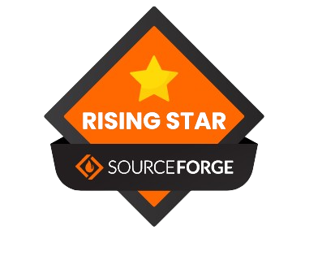
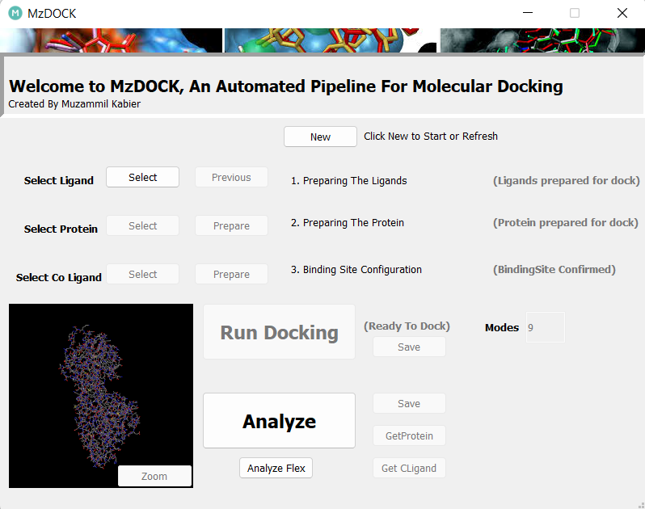
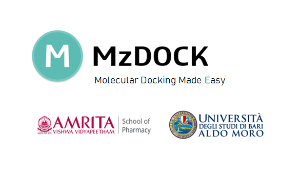

    
    

    

# MzDOCK
<h2> An Automated GUI based pipeline for Molecular Docking </h2>
<h4> Install MzDOCK (357 MB) by clicking on the button below: </h4>

<h4>Features</h4>
 <li>Multiple Ligand Docking</li>
 <li>Flexible Docking(Induced Fit)</li>
 <li>Co-crystallized Ligand Based Binding Site Configuration</li>
 <li>Various Ligand Input File Formats(.pdb,.sdf,.mol,.mol2,SMILES), Energy Optimization using Forcefields (MMFF94, MMFF94s,UFF,GAFF and Ghemical)</li>
 <li>Option to include Ions and Cofactors, Retain Water in the Protein</li>
 <li>Good Analysis report of protein-ligand complex</li>

# GUI Preview

    

# Architecture

MzDOCK is developed with Python and Batch Scripts. Currently compatible on Windows 

    

# User Guide

Click the given link below : <a href="USER GUIDE/Manual.pdf"> USER GUIDE </a>

Youtube Tutorial on "How To Use MzDOCK". Click on the link below: <a href="https://youtu.be/4iwza_4BiKc?si=vQ4HCPgz96av54Ls"> Tutorial </a>

# Cite Us

Kabier M, Gambacorta N, Trisciuzzi D, Kumar S, Nicolotti O*, Mathew B*. MzDOCK: a free ready-to-use GUI-based pipeline for molecular docking simulations. Journal of Computational Chemistry 2024  DOI: 10.1002/jcc.27390

<a href="https://onlinelibrary.wiley.com/doi/full/10.1002/jcc.27390"> Go to Article </a>

# Contact Us

<h2>Authors</h2>
<li>Muzammil Kabier - kabeermuzammil614@gmail.com </li>
<li>Prof. Dr. Bijo Mathew - bijomathew@aims.amrita.edu </li>
<li>Prof. Dr. Orazio Nicolotti - orazio.nicolotti@uniba.it </li>
<li>Dr. Nicola Gambacorta - nicola.gambacorta1@uniba.it </li>
<li>Dr. Daniela Trisciuzzi - daniela.trisciuzzi@uniba.it</li>
<li>Sunil Kumar - solankimedchem@gmail.com</li>

    

 
